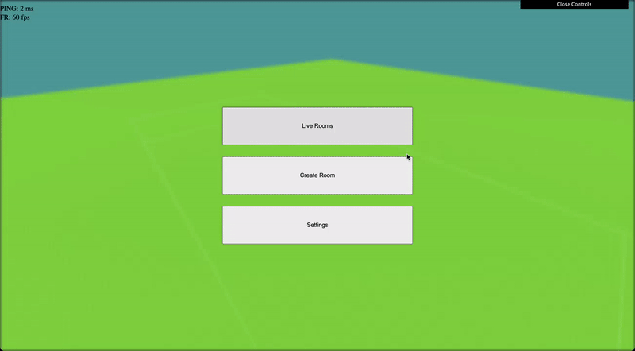

# 3D Ultimate Frisbee (Multiplayer)

## About the project

A multiplayer 3D Ultimate Frisbee sandbox!
Now play Ultimate with your friends across the world :D

The project was built with the intention of creating a game engine from scratch, implementing components including:
1. Asset loading & cache management
2. Character controllers and input controllers
3. Creating animations and models using Blender
4. Frisbee disc path trajectories
5. Animation transitions with FSMs (finite state machines)
6. HUDs and user interaction
7. Camera movement and panning

A test run in an Ultimate set play:


## Usage

The app is currently hosted on Heroku [here](https://ultimate-3d.herokuapp.com), but dependency issues have caused it to shut down the server.

In order host a local server instance, first the ```node_modules``` must be installed, based on the dependencies in ```package.json```.
```
npm install
```
Hosting a local server (localhost:8000) can be done by running any of the following:
```
node index.js
npm run start
nodemon
```
To host over LAN, edit the ```index.js``` file with a specific IP and port, and verify that it is accessible over your network.

## Menu Navigation



## Gameplay

Player movement and controls allow different kinds of movement, with and without the disc. This section is always in progress, with creating more animations and implementing transitions.

Examples of player movement:


## Built With

The app is built using ```Node.js``` at the backend.
The frontend is implemented using ```HTML/CSS``` and ```JS```.

Game mechanics are implemented in pure ```JavaScript``` and the 3d library used is ```THREE.js```.

Animations and character models have been edited using ```Blender```.
Rigs and animations downloaded from ```Mixamo```.


